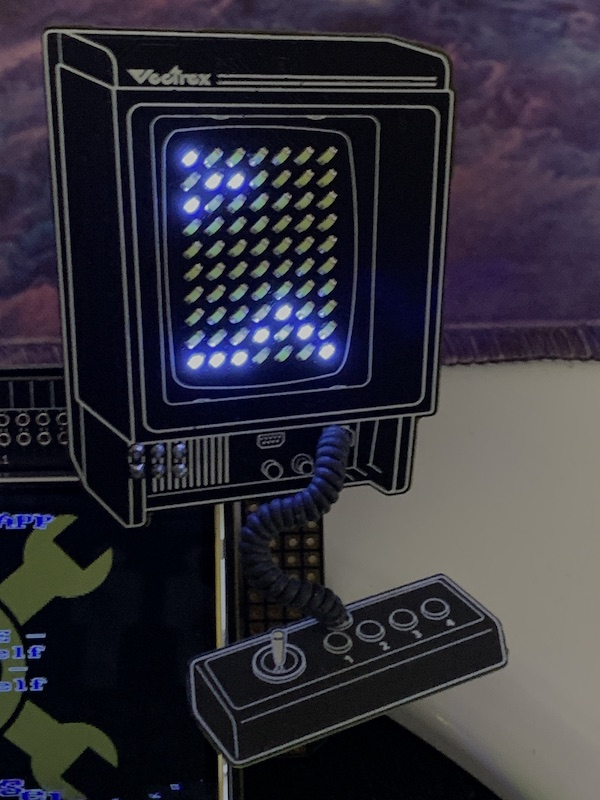

# Vectrex SAO

Hardware and software files for the mini playable Vectrex SAO by Brett Walach.  Made for Hackaday Supercon 2022!

# Features
- 7 x 10 White LED Charlieplexed display (placed in a slight perspective to match the Vectrex artwork!)
- Joystick is a 1-button capacitive touch controller
- PIC16F886 8K MCU
- Speaker (auto mutes if not playing, or can permanently disable with removing a solder blob)
- Coily cord!
- Jumpers for hacking, control it via I2C directly if you want from a main badge... and there's PWM input for the speaker and touch controller output for sensing button presses available to wire to the SAO connector.
- **High score permanently saved!** Tweet a pic of your score @Technobly #vectrex-sao #supercon #badgelife

# Video of it in action:

[Youtube.com/PlayVectrex](https://www.youtube.com/watch?v=_dLVXqdKwO0&ab_channel=PlayVectrex)

# License

Creative Commons Attribution-ShareAlike 4.0 International (CC BY-SA 4.0) - essentially do whatever you want, and if this is helpful to you [consider buying me a coffee](https://buymeacoffee.com/walach)  Full [LICENSE here](LICENSE)
