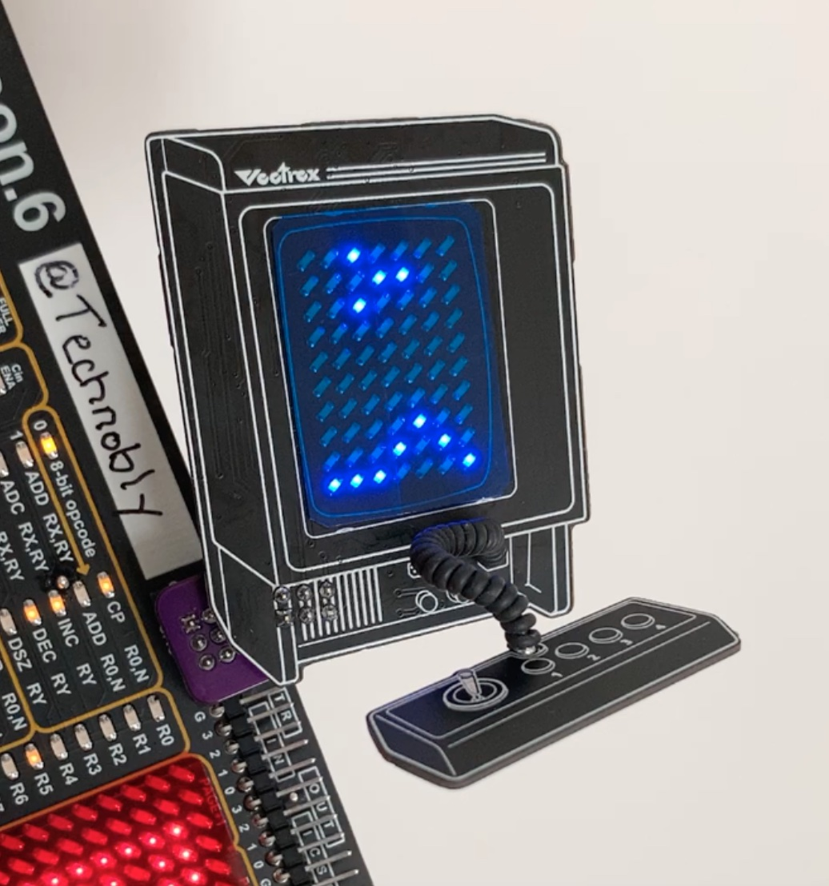
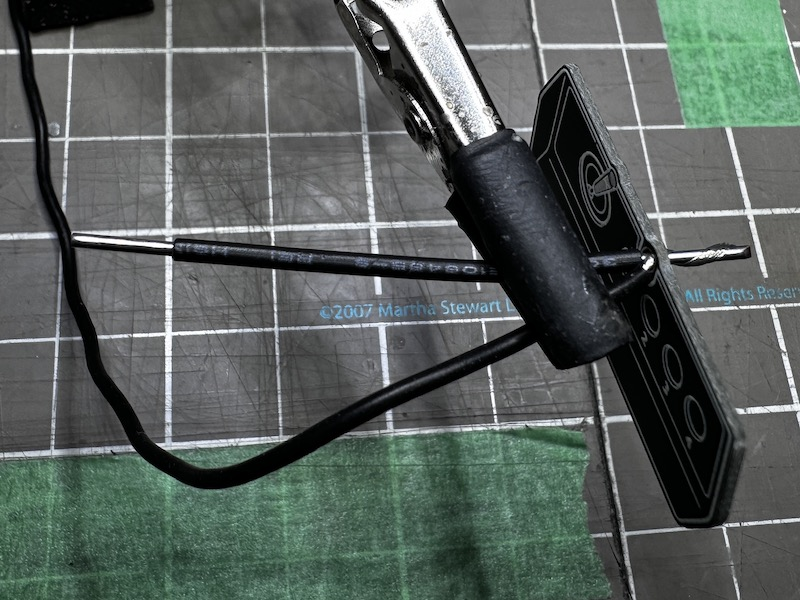

# Vectrex SAO

Hardware and software files for the mini playable Vectrex SAO by Brett Walach.  Made for Hackaday Supercon 2022!

# Features
- Mini playable low res version of Scramble
- 7 x 10 White LED Charlieplexed display (placed in a slight perspective to match the Vectrex artwork!)
- Joystick is a 1-button capacitive touch controller
- PIC16F886 8K MCU (I had a reel of these I pulled out of the trash, which is why it uses this relatively old and huge MCU.)
- Speaker (auto mutes if not playing, or can permanently disable with removing a solder blob)
- Coily cord!  This is made of a solid core silicone wire, and stranded core silicone wire.  These were an absolute pain to make.
- Jumpers for hacking, control it via I2C directly if you want from a main badge... and there's PWM input for the speaker and touch controller output for sensing button presses available to wire to the SAO connector.
- What's a Vectrex? [https://wikipedia.org/wiki/Vectrex](https://wikipedia.org/wiki/Vectrex)
- **High score permanently saved!** Tweet a pic of your score @Technobly #vectrex-sao #supercon #badgelife

# BOM

- PCBs: 1.0mm, HASL finish, white silkscreen, black soldermask, gives a nice thin feel to them.
- [gerbers/vectrex-sao.csv](gerbers/vectrex-sao.csv) contains all parts required to build the SAO
- [gerbers/vectrex-sao-leds-only.csv](gerbers/vectrex-sao-leds-only.csv) can be used to order just the LED side of the board assembled by JLCPCB
- Inner coily cord wire - 18 AWG solid core, black PVC jacket, outer diameter 1.6mm, 2.0" long with 0.25" stripped on both ends for a 1.5" long jacket. [Digikey 10982-18-1-2000-001-1-TD](https://www.digikey.com/en/products/detail/cnc-tech/10982-18-1-2000-001-1-TD/12749485)
- Outer coily cord wire - 26 AWG stranded core, black silicone jacket, outer diameter 1.3mm, ~27 turns, ~9" long. [Digikey 1175-3132-26-1-0500-001-1-TS-DS-ND](https://www.digikey.com/en/products/detail/cnc-tech/3132-26-1-0500-001-1-TS/15853654)

# Coily Cord Construction

#### 1. Wrap the 26 AWG stranded silicone wire around the 0.25" stripped end of the 18 AWG solid wire, but do not solder it yet.

#### 2. Add the controller PCB observing the proper orientation.

#### 3. Add a good amount of solder here, and push the board up against the wire bundle if possible (I did not push it up in this picture like I should have). 

#### 4. Flush cut the excess wire, but leave a bit sticking out so has a little mechanical strength.

#### 5. Wrap the silicone wire 21-27 times (21 if diameter is 1.5mm, 27 if 1.3mm).  Wrap the wire tightly and keep pushing it down on the solid core as you go.  Finally twist the stranded wires around the end and while holding that tightly, clamp the wire bundle to prevent it from unwinding.

#### 6. Now add the main PCB obsererving the correct orientation.

#### 7. Add a good amount of solder here as well. Flush cut the excess wire, but leave a bit sticking out so has a little mechanical strength.

#### 8. The one on the left used 1.5mm 26 AWG wire so it has 21 wraps, and the one on the right has a slightly smaller diameter wire 1.3mm so it requires 27 wraps.  Both will work fine, but 27 wraps looks a little closer to reality :smile:

# Video of it in action:

[Youtube.com/PlayVectrex](https://youtu.be/AfYQyKARwps?si=DoC_TBigiWhMu1rB)

# License

Creative Commons Attribution-ShareAlike 4.0 International (CC BY-SA 4.0) - essentially do whatever you want, and if this is helpful to you [consider buying me a coffee](https://buymeacoffee.com/walach)  Full [LICENSE here](LICENSE)
